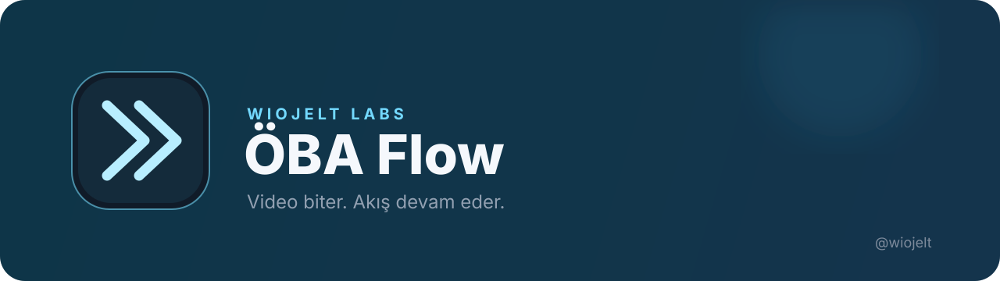

# ÖBA Flow

ÖBA içeriklerinde görünen **Kursu Başlat** / **Başlamak için tıklayınız** düğmelerini ve video sonunda etkinleşen **İLERİ** düğmesini kullanır. Mevcut içerik `check_circle` ile tamamlandığında listedeki hemen sonraki kilidi açılmış içeriğe geçebilir.

## Kurulum

1. ZIP'i bir klasöre çıkarın.
2. Brave'de `brave://extensions` sayfasını açın.
3. **Geliştirici modu**nu etkinleştirin.
4. **Paketlenmemiş öğe yükle** ile klasörü seçin.
5. ÖBA sayfasını yenileyin.

Popup üzerinden otomatik ileri ve içerik geçişi ayrı ayrı kapatılabilir. Tıklama gecikmesi 0–10 saniye arasında sabit olarak seçilir.

## Sınırlar

- İçeriği ileri sarmaz veya tamamlanmamış içeriği tamamlanmış göstermez.
- Yalnızca mevcut öğe `check_circle` olduğunda sıradaki kilidi açılmış öğeye geçer; son öğede durur.
- Sekme görünürlüğünü ya da tarayıcı odak durumunu taklit etmez.
- `Tamamla` veya `Bitir` düğmelerine basmaz.

Erişim ve iletişim: [Twitter @wiojelt](https://twitter.com/wiojelt) · [GitHub @Wiojelt](https://github.com/Wiojelt)

Copyright © 2026 wiojelt. All rights reserved.
